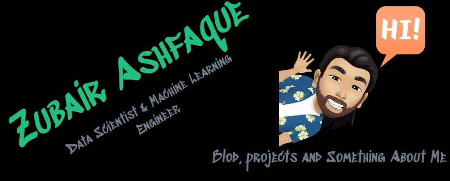
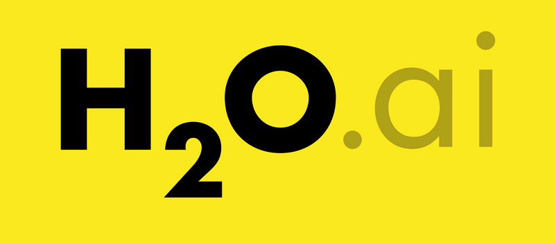
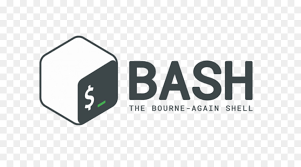

<!-- # Hey! 🙋‍♂️ I'm [ZUBAIR!] '#20c080' (https://zubairashfaque.github.io/) & I love TO Play With [Data! (:](https://www.kaggle.com/zubairashfaque) -->

  

<!--
<h1 align="center">
  
</h1> -->
<!--
<h1 align="center">
  
</h1> -->

<!--

 -->

<h5 align="center">
  <code>
    <a href="https://www.linkedin.com/in/zubair-ashfaque-ab100621/" title="LinkedIn Profile"> LinkedIn</a></code>
  <code><a href="https://www.hackerrank.com/zubairashfaque" title="HackerRank Profile"> HackerRank</a></code>
  <code><a href="https://github.com/zubairashfaque" title="github Profile"> Github</a></code>
  <code><a href="https://www.kaggle.com/zubairashfaque/" title="kaggle Profile"> Kaggle</a></code>
</h5>

 
 

Hello, my name is **Zubair Ashfaque**. I am a Telecom Engineers and Passionate Data Scientist & Machine Learning Engineer 📈 📊 📉 This might sound crazy but I have decided to change my career as a System Analyst to be a Data Scientist/ML Engineer to follow my passion in Data Science & AI 🦾  I will be sharing my experience and knowledge in Data Science, ML & DL on my personal [website](https://zubairashfaque.github.io/) and my [Medium](https://zubairashfaque.github.io/) account.

 

### About Me:
- 🎖 &nbsp; I’m [Certified TensorFlow Developer](https://www.credential.net/3b358440-6c1a-4a2f-9c0a-61da65d2450d#gs.g2jgj9)
- 📖  &nbsp; I'm currently learning [Algorithms](https://www.coursera.org/specializations/algorithms?) & [Natural Language Processing - Coursera Specialization](https://www.coursera.org/specializations/natural-language-processing) on [Coursera](https://www.coursera.org/user/157672adc56ebef7adde0712268a503f)

- 📚  &nbsp; I previously finished [DeepLearning.AI TensorFlow Developer](https://www.coursera.org/account/accomplishments/professional-cert/R8ZM3HN9A9CX), [IBM Data Science](https://www.coursera.org/account/accomplishments/professional-cert/WAY5687WJGHC), [Machine Learning with TensorFlow on Google Cloud Platform](https://www.coursera.org/account/accomplishments/specialization/ELA9UH2WESZP) and [DL](https://www.coursera.org/account/accomplishments/specialization/HU8J7CVWXRB4) specialization by Andrew Ng on [Coursera](https://www.coursera.org)
- 🎖 &nbsp; I’m looking for people to collaborate on Kaggle competitions
- 🙏 &nbsp; If you would like to build a team, please contact me!
- 📨 &nbsp; You contact me using mianashfaque@gmail.com
- 📑 &nbsp; Here is my most recent [Resume](https://zubairashfaque.github.io/resume/Zubair_Resume.pdf)

<h2 align="center"; style="color:#20c080" >🔥 Languages & Frameworks & Tools & Abilities 🔥</h2>

 

  <code></code>
  <code></code>
  <code></code>
  <code></code>  
  <code></code>
  <code></code>
  <code></code>
  <code></code>
  <code></code>
  <code></code>    
  <code></code>    
  <code></code>        
  <code></code>
  <code></code>  
  <code></code>
  <code></code>    
  <code></code>
  <code></code>
  <code></code>
  <code></code>
  <code></code>
  <code></code>    

<!-- ## 📘 My top open source projects -->
<h2 align="center">👨‍💻 Repositories 👨‍💻</h2>
 

  

      

  
  

      

  
  

      

  
  

      
<h4 align="center">
  <a href="https://github.com/zubairashfaque?tab=repositories" title="Show Repositories">🔎 Show More 🔍</a>
</h4>

