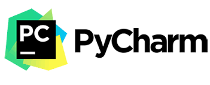
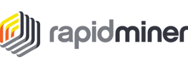

### _
Hi, I'm Zubair 👋, a passionate Data Scientist and Machine Learning Engineer dedicated to developing innovative solutions. 
_

 
    🎓 Currently working as a Machine Learning Engineer at Health Recovery Solutions. 
  
    🧠 A quick learner with a passion for exploring advancements in Machine Learning, AI, and data science technologies. 
  
    💪 Skilled in building and deploying data-driven solutions, from model development to production, transforming insights into impact. 
  
    🏋️‍♂️ Outside of work, I enjoy Gaming, playing Cricket, and football 👨‍🍳. 

## ✨ Projects Highlights ✨

<table>
    <tr>
    <td width="33%" valign="top">
      

        <h3>Slack</h3>
        <video width="100%" controls autoPlay mute src="https://github.com/user-attachments/assets/f9693bf4-d98b-4b57-9713-093c68104f34"></video>
         
        <a href="https://slack-clone-ruddy-nine.vercel.app" target="_blank">
          <button>View Site</button>
        </a>
        <a href="=https://github.com/achris-alonzo30/slack-clone" target="_blank">
          <button>View Repo</button>
        </a>
        
Slack Clone Website

      

    </td>
    <td width="33%" valign="top">
      

        <h3>Ryde</h3>
        </video>
         
        <a href="https://github.com/achris-alonzo30/uber-clone" target="_blank">
          <button>View Repo</button>
        </a>
        
Uber Clone Mobile App

      

    </td>
    <td width="33%" valign="top">
      

        <h3>DevVault</h3>
        <video width="100%" controls autoPlay mute src="https://github.com/user-attachments/assets/17885482-ee73-4b23-b7b8-c6bcea4d615c"></video>
         
        <a href="https://devvault.dev" target="_blank">
          <button>View Site</button>
        </a>
        
My First SaaS: NextJS Boilerplate

      

    </td>
  </tr>
  <tr>
    <td width="33%" valign="top">
      

        <h3>Hireme</h3>
        <video width="100%" controls autoPlay mute  src="https://github.com/user-attachments/assets/1147cf5e-b77d-467c-9435-afeb94ea6d96">
        </video>
         
        <a href="https://github.com/achris-alonzo30/hireme-capstone" target="_blank">
          <button>View Repo</button>
        </a>
        
Simplifies job search process.

      

    </td>
    <td width="33%" valign="top">
      

        <h3>InStock</h3>
        <video width="100%" controls autoPlay mute src="https://github.com/user-attachments/assets/8b1f5212-05d5-4837-8de0-7bcef70c9207"></video>
         
        <a href="https://github.com/achris-alonzo30/south-american-horned-frog-instock" target="_blank">
          <button>View Repo</button>
        </a>
        
Collaborative project management. 

      

    </td>
    <td width="33%" valign="top">
      

        <h3>Boxtrac</h3>
        <video width="100%" controls autoPlay mute src="https://github.com/user-attachments/assets/272305c8-c374-4f1f-88a2-126f0e75a482"></video>
         
        <a href="https://github.com/achris-alonzo30/boxtrac" target="_blank">
          <button>View Repo</button>
        </a>
        
Inventory and Order Management System.

      

    </td>
  </tr>
  <tr>
    <td width="33%" valign="top">
      

        <h3>Epigram</h3>
        <video width="100%" controls autoPlay mute src="https://github.com/user-attachments/assets/e623cbbe-beb4-416d-b378-759e6ddca7a3"></video>
         
        <a href="https://epigram-plum.vercel.app/" target="_blank">
          <button>View Site</button>
        </a>
        <a href="https://github.com/achris-alonzo30/Epigram" target="_blank">
          <button>View Repo</button>
        </a>
        
Story telling platform for your pets.

      

    </td>
    <td width="33%" valign="top">
      

        <h3>iNote</h3>
        <video width="100%" controls autoPlay mute src="https://github.com/user-attachments/assets/cc71dbe9-dffd-4e0c-a49c-6f96448af85a"></video>
         
        <a href="https://inote-six.vercel.app/" target="_blank">
          <button>View Site</button>
        </a>
        <a href="https://github.com/achris-alonzo30/next-iNote" target="_blank">
          <button>View Repo</button>
        </a>
        
Minimalist note-taking platform powered by AI.

      

    </td>
    <td width="33%" valign="top">
      

        <h3>Prism</h3>
        <video width="100%" controls autoPlay mute src="https://github.com/user-attachments/assets/dd0337ef-0661-4c8d-934b-cb283256931b"></video>
         
        <a href="https://prism-silk.vercel.app/" target="_blank">
          <button>View Site</button>
        </a>
        <a href="https://github.com/achris-alonzo30/prism" target="_blank">
          <button>View Repo</button>
        </a>
        
Real-time document management system powered by AI.

      

    </td>
  </tr>
</table>

###

<h2 align="left">️ 🛠️ 🧰 🗄️ 💻 Something I always like to play with 💻 🗄️ 🧰 🛠️</h2>

### Frontend

  <code></code>
  <code></code>
  <code></code>
  <code></code>  
  <code></code>
  <code></code>
  <code></code>
  <code></code>
  <code></code>
  <code></code>    
  <code></code>    
  <code></code>        
  <code></code>
  <code></code>  
  <code></code>
  <code></code>    
  <code></code>
  <code></code>
  <code></code>
  <code></code>
  <code></code>
  <code></code>    

 

## 🔥 Stats 🔥

  
  

  

